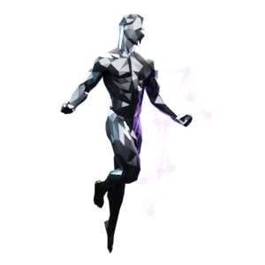

<p align="center"> 
  
</p>

<h1 align="center"> CALIMANICS </h1>
<div align='center'>
  

<a href='https://thirsty-brattain-52b1a8.netlify.app/'>

</a>
</div>

<table>
<tr>
<td>
  This is a workout app for athletes who want to motivate each other. You can create a new workout plan and send it so a friend, so that you both have to do a certain amount of repetitions. It uses the neural network <a href="https://github.com/tensorflow/tfjs-models/tree/master/pose-detection"> posenet </a> to superwise the workout, so that nobody can cheat and the reps are counted properly. The app is built with <a href="https://jamstack.wtf/">Jamstack</a> (JavaScript, API & Markup), <a href="https://www.netlify.com/products/functions/">serverless functions</a> (for notifications and database handling), <a href="https://fauna.com/">fauna</a> (database):floppy_disk:, and published with netflify<a href="https://www.netlify.com/">netflify</a> :ocean:.
  
</td>
</tr>
</table>

<p align="center"> 
  
</p>

---

<div align='center'>
  
### Quick Links

<a href='https://medium.com/@krull.matthes'>

</a>

<a href='https://github.com/krullgit'>

</a>

<br />  
<br />
</div>

---


<!-- TABLE OF CONTENTS -->
<h2 id="table-of-contents"> :book: Table of Contents</h2>

<details open="open">
  <summary>Table of Contents</summary>
  <ol>
    <li><a href="#test"> ➤ About The Project</a></li>
  </ol>
</details> 


## Getting Started

Linux installation:

```sh
yarn install # install package into the "/node_modules" folder
npm install netlify-cli@2.58.0 -g # install netlify package globally
sudo netlify init # create the "/.netlify" folder
sudo netlify build # build serverless functions into the "/.netlify" folder
sudo netlify dev # and select "yarn build" to build the website into the dist folder
sudo netlify dev # and select "yarn watch" to start the server
```
The website is running now, here:
```sh
http://localhost:8888/
```




### Troubleshooting 
- If you have any problems with the netflify, try to reinstall it:
    - Therefore delete netlify folder: *usr/local/lib/node_modules/netlify-cli*


## Roadmap

See the [open issues](https://github.com/dec0dOS/amazing-github-template/issues) for a list of proposed features (and known issues).

- [Top Feature Requests](https://github.com/krullgit/pullup/issues?q=label%3Aenhancement+is%3Aopen+sort%3Areactions-%2B1-desc) (Add your votes using the 👍 reaction)
- [Top Bugs](https://github.com/krullgit/pullup/issues?q=is%3Aissue+is%3Aopen+label%3Abug+sort%3Areactions-%2B1-desc) (Add your votes using the 👍 reaction)
- [Newest Bugs](https://github.com/krullgit/pullup/issues?q=is%3Aopen+is%3Aissue+label%3Abug)


## License

No license so far.


## Acknowledgements

Thanks for these awesome resources that were used during the development of the **Amazing GitHub template**:

- <https://github.com/tensorflow/tfjs-models/tree/master/pose-detection>


